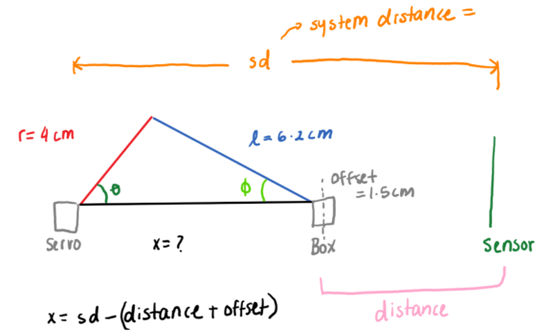
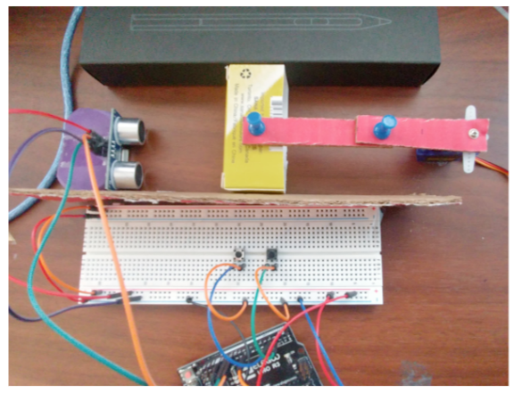

# SliderCrank-PID-control
> The program implements a slider-crank mechanism that controls the linear distance from a block to an ultrasonic sensor via the PID control algorithm. The mechanical components specific to the design are listed as constants 'r' and 'l'. The constants repersent the lengths of the linkage arms. The program uses 2 push buttons. Push button 1 increases the setpoint by 0.1 cm and push button 2 decreases the setpoint by 0.1 cm. The servo moves in response to the moving ultrasonic sensor block and the newly defined setpoints.

## Table of contents
* [General info](#general-info)
* [Technologies](#technologies)
* [Design Schematic](#design-schematic)
* [Circuit Setup](#circuit-setup)
* [Status](#status)
* [Contact](#contact)

## General info
The purpose of this project is to explore the PID algorithm with the Atmega328 uController

## Technologies
* ArduinoIDE- version 1.8.13
* Arduino PID Library- version 1.2.0 - by [Brett Beauregard ](https://github.com/br3ttb/Arduino-PID-Library)

## Design Schematic

> Schematic for Slider Crank Mechanism

## Circuit Setup

> Mechanical & Electrical Set Up

## Status
Project is: _finished_

## Contact
Created by [@akansha-n888](https://www.linkedin.com/in/akansha-nagar/) - feel free to contact me!
